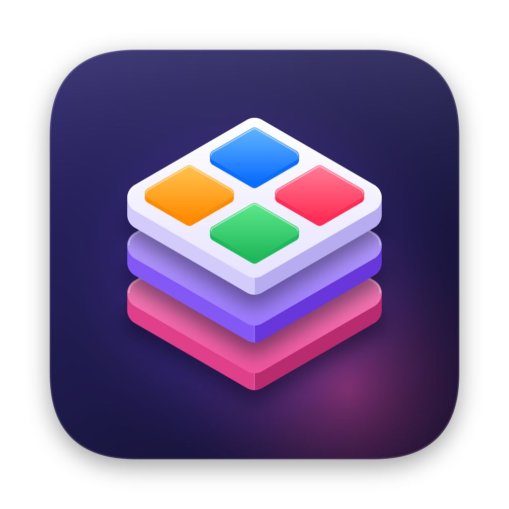

<p align="center">
  
</p>

<h1 align="center">Stack</h1>

<p align="center">
  <b>Toutes tes apps en un clic, rangées au même endroit.</b> Une petite app Mac native qui ouvre d'un coup toutes les apps que tu utilises ensemble — et qui peut les ranger chez elle pour qu'elles quittent Applications.<br>
  <i>All your apps in one click, kept in one place — a tiny native Mac launcher that can also house your apps.</i>
</p>

---

## 🇫🇷 Français

### Ce que ça fait
- **Un clic = tout s'ouvre.** Clique sur Stack : toutes les apps de tes groupes s'ouvrent, une petite bulle apparaît en haut de l'écran, puis Stack se ferme tout seul.
- **Groupes** pour trier tes apps (ex. *Menu bar*, *Travail*, *Musique*), avec icône et couleur. Chaque groupe peut s'ouvrir au clic ou seulement à la demande.
- **4 modes par app** : *Normal*, *Arrière-plan* (ne te coupe pas), *Caché* (fenêtres masquées) ou *Toujours caché* (reste caché même quand une autre app l'ouvre — ex. Sapphire qui ouvre Spotify).
- **Garder ouverte** (option, par app) : si l'app se ferme, Stack la rouvre (sauf si tu la quittes depuis Stack).
- **Hors du Dock** (option, par app, ou « Tout retirer du Dock » dans les Réglages). Les apps de la barre des menus (ExpressVPN, Amphetamine…) gèrent elles-mêmes leur icône et ne sont pas concernées. Pour les apps normales : l'app se comporte comme une app de la barre des menus, sans icône en bas. Stack modifie un seul réglage de l'app (`LSUIElement`) et la re-signe ; les fichiers d'origine sont sauvegardés et **Restaurer** remet tout comme avant. Stack refait la modification après chaque mise à jour de l'app et **teste que l'app démarre encore** : certaines apps (ex. Spotify) vérifient leur propre signature et refusent de tourner une fois modifiées, Stack les remet alors comme avant et les marque « Reste dans le Dock ». macOS demande une fois l'autorisation « Gestion des apps ».
- **Dans Stack** (option, par app) : Stack déplace la vraie app dans son propre dossier (`~/Library/Application Support/Stack/Apps`). Elle disparaît d'Applications, du Launchpad et de Spotlight, et c'est Stack qui l'ouvre. Rien n'est modifié dans l'app, elle garde ses réglages et ses autorisations, et **désactiver l'option la remet dans Applications**. Pour les apps de l'App Store, macOS demande ton mot de passe ; leurs mises à jour risquent de ne plus les trouver (remets l'app dans Applications pour la mettre à jour). Une app retirée de son dernier groupe retourne toute seule dans Applications.
- **Icône dans la barre des menus** : les apps cachées y sont listées (clic = afficher / cacher). Compatible avec Ice.
- **Tout quitter** en un clic (dans la bulle ou les Réglages).
- **Lancement au démarrage du Mac** (optionnel).
- **Raccourcis Autorisations** : ouvre directement le bon panneau (Accessibilité, Enregistrement de l'écran…) quand une app redemande l'accès.
- Interface en **français** ou **anglais** selon la langue du Mac.

### Tes apps restent indépendantes, sauf si tu décides le contraire
Par défaut, Stack ne copie, ne déplace et ne modifie **aucune** app : il retient seulement leur identifiant (*bundle ID*) et les ouvre comme un double-clic dans le Finder. Les mises à jour de tes apps ne cassent donc rien, et si une app est déplacée, Stack la retrouve tout seul. Les deux exceptions sont des options que tu actives app par app : « Hors du Dock » (modifie un réglage de l'app) et « Dans Stack » (déplace l'app chez Stack). Les deux se défont en un clic.

> Si un jour tu supprimes Stack, remets d'abord tes apps dans Applications (Réglages › Dans Stack › **Tout remettre dans Applications**).

### Utilisation
| Action | Comment |
|---|---|
| Ouvrir tes apps | Clique sur Stack (Dock, Launchpad, Spotlight) |
| Ouvrir les Réglages | Maintiens **⌥ Option** en ouvrant Stack, ou clique **Réglages** dans la bulle |
| Ajouter des apps | Bouton **Ajouter des apps**, ou glisse des apps depuis le Finder dans la fenêtre |
| Réordonner | Glisse les apps / groupes dans les listes |

### Installation
1. Télécharge le dernier `Stack-x.y.z.dmg` dans **[Releases](../../releases)**.
2. Ouvre le DMG et glisse **Stack** dans **Applications**.
3. Premier lancement : Stack n'est pas signé par un compte développeur Apple payant, donc macOS affiche un avertissement.
   Va dans **Réglages Système › Confidentialité et sécurité** et clique **Ouvrir quand même** (une seule fois).
   <sub>Ou dans le Terminal : `xattr -dr com.apple.quarantine /Applications/Stack.app`</sub>

### À propos des autorisations
macOS donne chaque autorisation (Accessibilité, etc.) à **une app précise**. Aucune app — Stack compris — ne peut transmettre ses accès aux autres. Stack n'a lui-même besoin d'aucune autorisation.

---

## 🇬🇧 English

**Stack** opens every app you use together with a single click, shows a small bubble for a few seconds, then quits.

- Groups with icons & colors; each group can open on click or on demand
- Per-app launch mode: *Normal*, *Background*, *Hidden*, *Always hidden* (stays hidden even when another app launches it)
- Per-app *Keep open* (reopens the app if it closes)
- Per-app *Out of Dock* for regular apps: it sets `LSUIElement` in the app's Info.plist and re-signs it ad hoc (original files backed up, one-click restore, re-applied after updates). Needs the App Management permission.
- Per-app *In Stack*: moves the real app into Stack's own folder (`~/Library/Application Support/Stack/Apps`), so it leaves Applications, Launchpad and Spotlight and is opened by Stack. The app isn't modified; turning the option off moves it back. App Store apps need an administrator password and may stop receiving updates while they live in Stack.
- Menu bar icon listing your hidden apps (click to show/hide)
- *Quit all* button, launch at login, shortcuts to the right Privacy & Security pane
- Hold **⌥ Option** while opening Stack to show the settings
- Apps are referenced by bundle identifier — never moved or modified unless you turn on *Out of Dock* or *In Stack*
- English & French UI, no network access, no tracking

**Install:** download the DMG from [Releases](../../releases), drag Stack to Applications. On first launch, open **System Settings › Privacy & Security** and click **Open Anyway** (the app is ad-hoc signed, not notarized).

---

## 🛠 Build from source

Only the Xcode **Command Line Tools** are needed (`xcode-select --install`). macOS 13 Ventura or later.

```bash
bash build.sh                        # build for this Mac and install in /Applications
BUILD_MODE=release bash build.sh     # universal (Apple Silicon + Intel) + DMG in dist/
```

Other scripts:
- `python3 scripts/make_icon.py` — regenerates the icon and the DMG background (numpy + Pillow)
- `python3 scripts/check_strings.py` — checks every UI string is translated and regenerates the `.strings` files

### Publish a release
Push a tag and GitHub Actions builds the universal DMG and attaches it to a new release:
```bash
git tag v1.0.0 && git push origin v1.0.0
```

### Project layout
```
Sources/        Swift (AppKit + SwiftUI)
Resources/      Info.plist, icon, translations, DMG background
scripts/        icon generator, translation checker
build.sh        build / install / DMG
ci/             GitHub Actions workflow (copied to .github/workflows by build.sh)
```

Settings are stored in `~/Library/Application Support/Stack/config.json`.

## License
MIT © 2026 Toma
